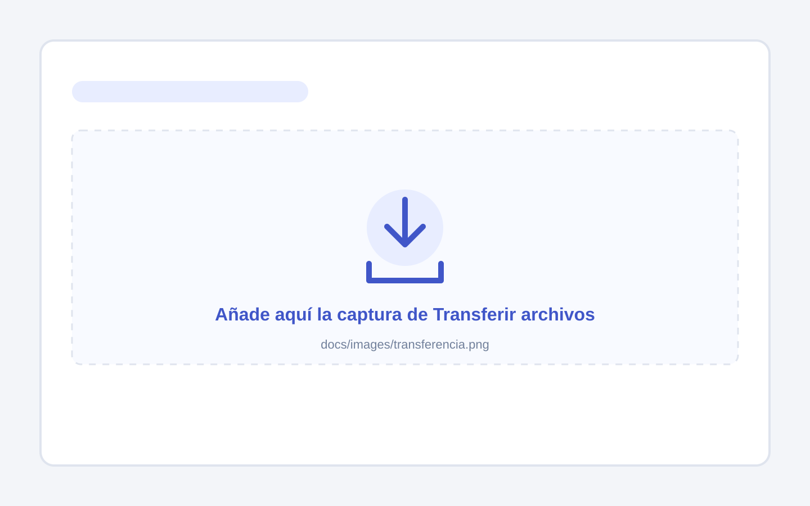
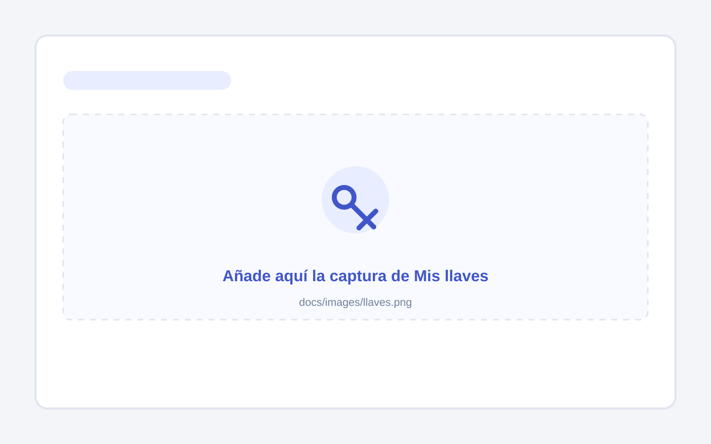
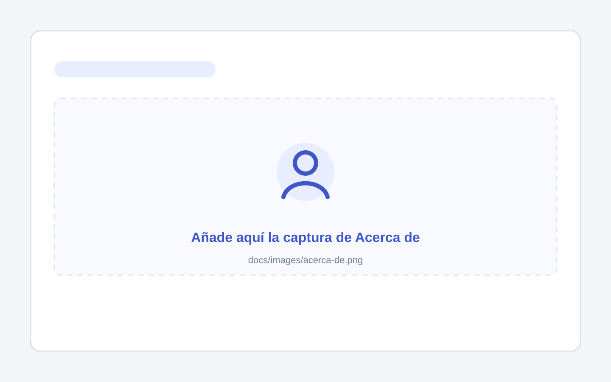
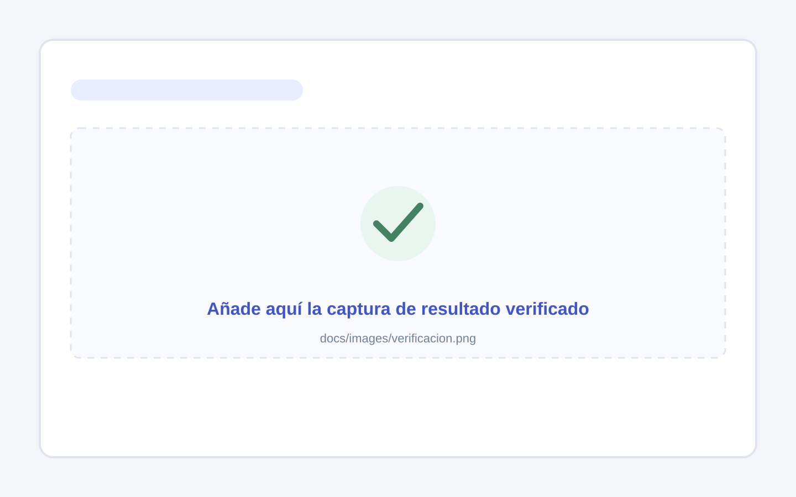
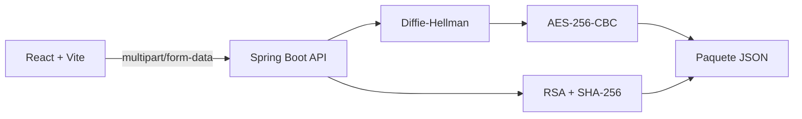

# Nexo · Criptografía híbrida

<p align="center">
  Aplicación académica para proteger archivos mediante intercambio de llaves, cifrado y firma digital.
</p>

<p align="center">
  <a href="#características">Características</a> ·
  <a href="#ejecución-local">Ejecución local</a> ·
  <a href="#uso">Uso</a> ·
  <a href="#despliegue">Despliegue</a>
</p>

> Proyecto académico de la Escuela Superior de Cómputo (ESCOM) del Instituto Politécnico Nacional (IPN).

## Vista previa

Reemplaza cada panel de ejemplo por una captura real manteniendo el mismo nombre de archivo. Las imágenes se guardan en [`docs/images`](docs/images).

| Transferencia de archivos | Gestión de llaves |
| --- | --- |
|  |  |

| Página Acerca de | Resultado verificado |
| --- | --- |
|  |  |

Los paneles son marcadores de posición visibles. Sustituye cada archivo SVG por una captura PNG o WebP conservando su nombre base, y ajusta la extensión en este README. Consulta [`docs/images/README.md`](docs/images/README.md) para los tamaños recomendados.

## Características

- Cifrado de archivos con AES-256-CBC derivado de un intercambio Diffie-Hellman.
- Firma y verificación de integridad con RSA y SHA-256.
- Flujos independientes: cifrar, firmar, descifrar o verificar; también se pueden combinar.
- Paquetes JSON transportables que preservan archivos binarios sin modificar sus bytes.
- Generación local de llaves RSA y parámetros de intercambio en el navegador mediante Web Crypto.
- Interfaz React accesible en español, adaptada para escritorio y móvil.
- Descarga bloqueada cuando una firma no supera la verificación de integridad.

## Arquitectura



El frontend prepara las llaves y solicitudes. El backend procesa exclusivamente arreglos binarios, genera el paquete JSON o devuelve el archivo recuperado. Las llaves privadas y los resultados se mantienen en memoria durante la sesión del navegador.

## Tecnologías

| Capa | Tecnología |
| --- | --- |
| Interfaz | React 19, TypeScript, Vite y Thinking Orbs |
| API | Java 21 y Spring Boot 4 |
| Criptografía | Diffie-Hellman, AES/CBC/PKCS5Padding, RSA/SHA-256 |
| Contenedores | Docker y Docker Compose |

## Ejecución local

### Requisitos

- JDK 21 o posterior.
- Node.js 24 o posterior.
- Docker Desktop, solo si se usará el contenedor.

### Desarrollo

En una terminal, inicia la API desde la raíz del proyecto:

```powershell
.\mvnw.cmd spring-boot:run
```

En otra terminal, inicia la interfaz:

```powershell
cd Frontend
npm ci
npm run dev
```

Abre `http://localhost:5173`. Vite reenvía las rutas `/api` a Spring Boot en `http://127.0.0.1:8080`.

## Uso

1. El destinatario crea y descarga su intercambio de llaves desde **Mis llaves**. Comparte solo el archivo público.
2. El remitente carga el archivo y elige cifrado, firma o ambos. Para firmar utiliza su llave privada RSA.
3. El remitente descarga el paquete JSON y comparte también su llave pública RSA cuando haya firmado.
4. El destinatario carga el paquete, su respaldo privado Diffie-Hellman y, si aplica, la llave pública RSA del remitente.
5. Nexo recupera el archivo solo si las operaciones solicitadas se completan. Cuando la firma no coincide, bloquea la descarga.

No compartas respaldos privados ni llaves privadas RSA. Para un sitio público usa HTTPS: las APIs criptográficas del navegador requieren un contexto seguro fuera de `localhost`.

## API y límites

| Ruta | Método | Descripción |
| --- | --- | --- |
| `/api/crypto/process` | `POST` | Cifra, firma o combina ambas operaciones y devuelve un paquete JSON. |
| `/api/crypto/verify-decrypt` | `POST` | Verifica, descifra o combina ambas operaciones y devuelve el archivo recuperado. |

Las solicitudes son `multipart/form-data`. El archivo de entrada admite hasta 10 MiB; un paquete recibido, hasta 16 MiB; y una llave PEM, hasta 64 KiB. Las respuestas usan `400` para solicitudes inválidas, `413` para tamaños excedidos y `422` para errores de integridad.

## Verificación

Frontend:

```powershell
cd Frontend
npm run lint
npm run build
npm test
```

Backend:

```powershell
.\mvnw.cmd test
```

Con ambos servicios activos, la prueba de integración verifica los tres modos de operación, conserva los bytes originales y rechaza firmas alteradas:

```powershell
cd Frontend
npm run test:integration
```

## Despliegue

El proyecto incluye una imagen multietapa que compila la interfaz y la sirve desde Spring Boot, además de un archivo `compose.yaml` con límites de memoria, sistema de archivos de solo lectura y health check.

```sh
docker build -t nexo:local .
docker compose up -d --no-build
```

La guía completa para publicar la imagen en Docker Hub y desplegarla en Amazon EC2 con HTTPS mediante Application Load Balancer está en [DEPLOYMENT.md](DEPLOYMENT.md).

## Autores

- Carmona Marinez Ricardo
- Diaz Torres Jonathan Samuel
- Velazquez Parral Saul Asaph

Escuela Superior de Cómputo · Instituto Politécnico Nacional
